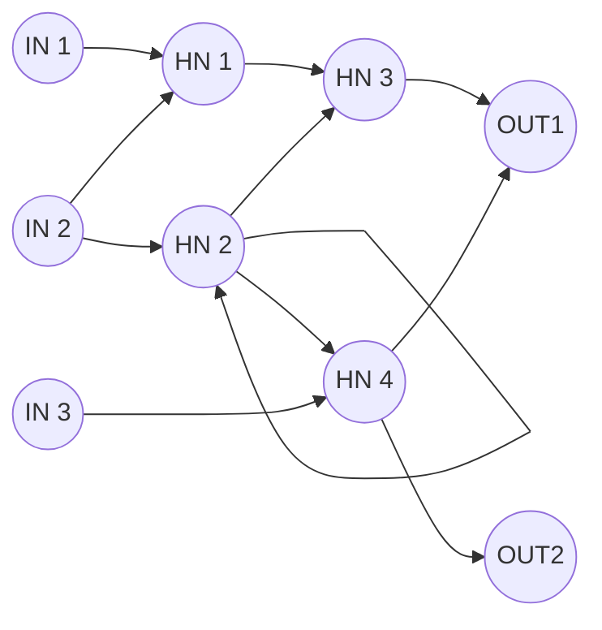
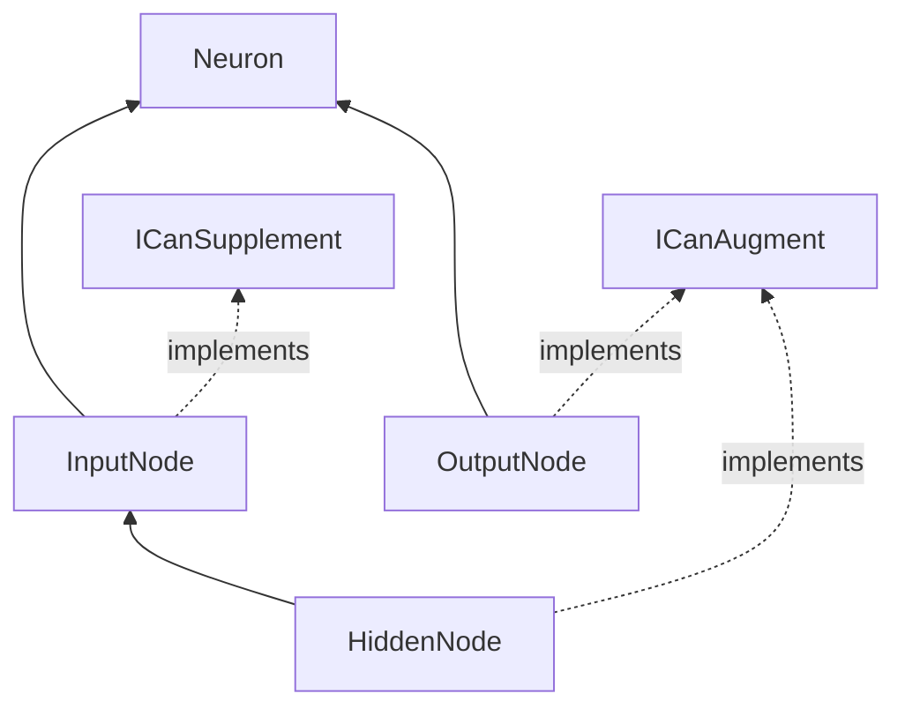

# Definitions

## **Module**
A logical class that controls its host. Modules can create input and output nodes to allow for integration into the creature's logic.

## **Node**
A calculation point in the neural network, categorized into three types: input, hidden, and output. The diagram below illustrates the structure of the network. Note that there are no additional layers beyond these three categories. Nodes can also have recursive connections, forming loops to themselves or connecting back to previous nodes.

### **Input node**
Collects external information to create a signal that is provided to the network. Input nodes are not directly affected by other neurons unless explicit logic is implemented in the module that created them.

### **Hidden node**
A purely calculative point within the neural network. Hidden nodes receive inputs from input nodes and other hidden nodes, perform calculations, and provide appropriate outputs to either other hidden nodes or output nodes.

### **Output node**
Collects values from input nodes and hidden nodes, using a simple activation function of which the result can be read from the `Result` property. Output nodes do not contain logic for what they actuate, as this is typically determined by the module they are associated with.

### **Diagram**

## **Neural connection**
A connection between two nodes in the neural network. Each connection has a weight (multiplier) ranging from -4 to 4.

## **Actor**
An Actor represents an entity within the framework that can interact with the world. It serves as a fundamental unit capable of performing actions and responding to stimuli. Actors can be seen as dynamic entities within the framework. They represent the living or interactive components that populate and shape the simulated world. Each Actor possesses its own set of abilities, behaviors, and characteristics defined by the Modules associated with it.

Actors can be designed as AI entities, where Modules enable them to exhibit intelligent behavior and decision-making processes. Additionally, Actors can also represent environmental objects, such as plants or water sources, by utilizing Modules that simulate specific characteristics like photosynthesis or providing a food source.

By combining different Modules and defining their interactions, Actors can perform complex actions and contribute to the overall dynamics of the simulated world.

Please refer to the [implementation documentation](IMPLEMENTATION.md) for more details on how to create and configure Actors with appropriate Modules for your desired behaviors.

## **CachedLoader**
Dynamically loads modules and neurons during runtime. Can be used as a single-time load or a scheduled repeated load. 

A utility that dynamically loads modules and neurons during runtime. It monitors the provided folder, providing flexibility in extending the functionality of the framework.

## **CachedLoader** (`planned`)
A utility that dynamically loads modules and neurons during runtime, offering flexibility in extending the functionality of the framework.

The CachedLoader is responsible for dynamically loading modules and neurons from a specified folder during the runtime of the application. It provides a convenient way to add new functionality to the framework without requiring a full rebuild or restart. By monitoring the designated folder, the CachedLoader ensures that any new modules or neurons added to the folder are automatically detected and integrated into the system. This feature allows for easy experimentation and expansion of the framework's capabilities without disrupting the runtime environment.
