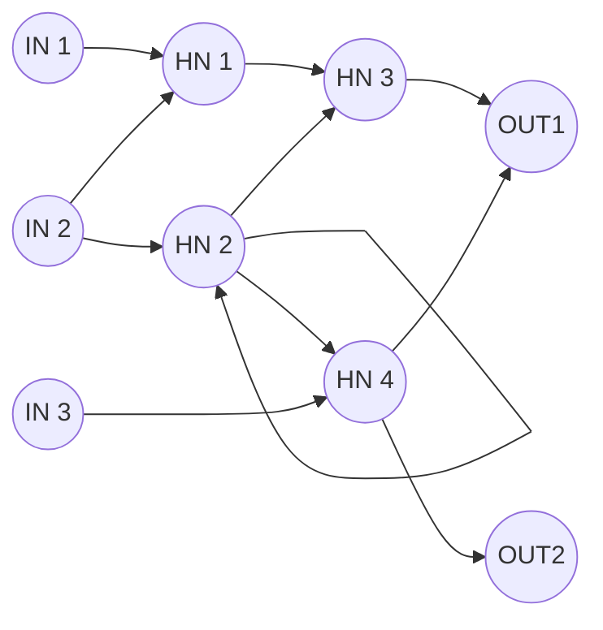
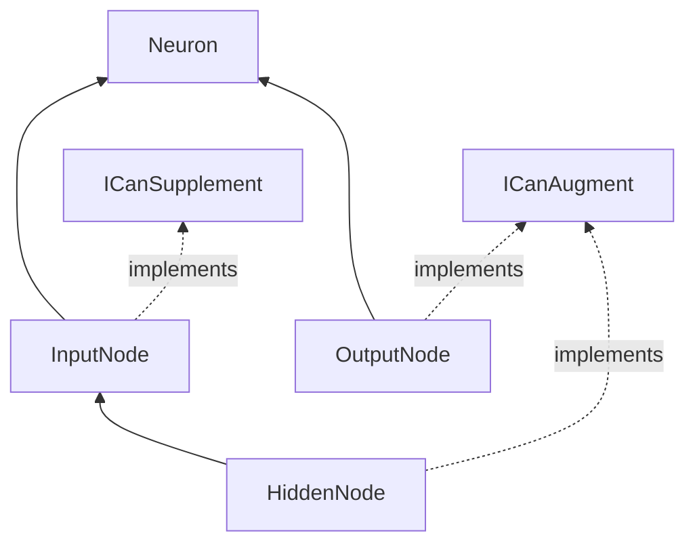

# Definitions

## **Module**
Logical class that controls its host. Can create input and output nodes to allow for integration into the creatures logic.

## **Node**
Calculation point in the neural network. Separated into three categories. Input, internal(hidden), and output. As you can see on the diagram below, there's no "layers" other than those three categories. In addition to this, there's possibility for recursion both in forms of loop to self, and a connection back to a previous node.

### **Input node**
Collects external information to create a signal that is provided to the network. Not affected by other neurons unless explicit logic is made in the module that created it.

### **Hidden node**
Purely calculative point. Takes values from input nodes and other hidden nodes, then calculates an appropriate output that is sent to either an output node or a hidden node.

### **Output node**
Collects values from input nodes and hidden nodes, and uses a simple activation function to decide wether the output activates. Also contains logic for what the node actuates (usually closely related to the module it was created from).

### **Diagram**

## **Neural connection**
Connection between two nodes. Has a weight (multiplier) from -4 to 4.

## **Actor**
A "dumb" AI, that can be hard-coded to a specific task. Useful for making environmental effects.

## **Learner**
Collection of modules and neurons.

## **Loader**
Dynamically loads modules and neurons during runtime. Can be used as a single-time load or a scheduled repeated load. 

